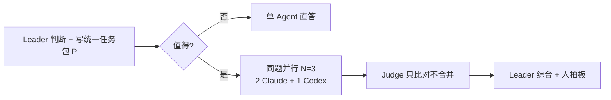

# zhimeng-fusion · 同题并行协商

让主会话在命中场景时，**自动**以「同题并行 → Judge 比对 → Leader 综合 → 人拍板」完成任务，而不是单 Agent 直答。本地复刻 OpenRouter Fusion 的公开协作形态——judge/panel 的真实提示词与后端编排 OpenRouter 未公开，本 skill 的提示词全部自研，不冒充官方。

**默认同题并行**：同一个完整问题发给多个上下文隔离 Agent，各自独立完整作答（不是拆任务分工）。拆分工只在"同题并行完成后"作为可选的 Hybrid 验证模式启用（见末节）。

## 触发（命中任一即自动进入；除非用户说"不要多 Agent / 求快 / 只输出"）

- 用户明确：多 Agent / Fusion / 多模型评审 / 协商 / 并行问几个 / 让几个 AI 想想
- 高风险且不可逆：架构选型、改 schema、鉴权、支付、迁移、生产发布、跨 3+ 模块
- 技术调研 / 方案比较 / 选型 / 架构评审 / 产品决策 / 复杂实现前的路线选择
- Leader 自评：错误代价高 且 单模型置信度低

自动进入即直接开跑，不要反问用户"要不要开多 Agent"。只在命中"不适用"或成本明显不值时，才说明理由并降级单 Agent。

## 不适用（命中则降级单 Agent，省 4–5 倍成本）

- 简单命令 / 翻译 / 格式转换 / 有唯一正确答案的检索（查 API 用 find-docs）
- 用户要求"只输出 / 不要解释 / 快"
- 低风险单文件小改、已有明确执行路径
- 敏感信息无法脱敏

## 流程



## 角色与具体编排（要真执行，不只是说明）

- **Leader（主会话）**：把问题压成中立、自包含、无倾向的统一任务包 P（问题原文 + 背景 + 约束 + 必须覆盖的小节 + 输出要求），P 要能脱离上下文独立作答。分发前脱敏：剥离密钥 / 客户数据 / 内部地址 / 真实姓名。
- **同题并行起 3 个 Worker**（在一条消息内并发下发，全部拿字节级相同的 P）：
  - **Claude 子 Agent ×2**：用 Agent 工具，`subagent_type=general-purpose`，两个用不同 model（如 `opus` + `sonnet`）保证模型多样性；prompt = P + "你是独立 Worker，完整独立作答，不分工、不参考他人、不假设别人补充"。
    - 如果只能用 `claude -p` / CLI 代替 Agent 工具：前台同步长等待；把 prompt、stdout、stderr、exit code 分别落盘；prompt 强制"只在 stdout 输出完整正文，不写文件、不只回摘要/已交付占位语"。
    - CLI 输出验收：非空完整正文才算成功；`API Error`、timeout、空响应、只说"方案文件已完成/已交付"、只给摘要、声称写文件但找不到文件，都记为 failed 或 retry，不进入 Judge 正文。
    - 代理策略：不要盲目叠加代理。遇到 proxy/gateway/HTTP 200 malformed/timeout 类错误时，最多切换一次代理策略重试，并记录两次错误原文。
  - **Codex 子 Agent ×1**：如果当前环境提供 Codex 子 Agent 工具，直接使用该工具；如果只提供 CLI wrapper，则使用本机已安装的只读 Codex wrapper：
    ```bash
    cat <P文件> | <codex-wrapper> \
      --cd <可写临时目录> --sandbox read-only --reasoning high --out <out文件>
    ```
    前台同步调用，**禁 run_in_background**（Codex 后台模式可能卡在 stdin）。如果没有可用 Codex 子 Agent 或 wrapper，记录降级原因并继续。
  - **至少 1 个 Codex**：跨模型族是防"共识但错"的第一道防线，同源模型共识会共享盲区。
- **Judge**：独立子 Agent（高风险时必须独立，不由主会话兼任），输入原题 P + N 份回答，**只比对不合并、不写终稿**，输出下方 JSON。
- **Leader 综合**：读 Judge JSON 写终稿——保留少数派洞察，对 facts_to_verify 的关键项用工具核验或显式标"未核实"，列出"需用户拍板项"。
- **运行证据**：每次 Fusion 建一个临时 run 目录，保存统一任务包、各 Worker stdout/stderr、重试记录、Codex/Claude 日志和最终纳入 Judge 的回答。不要只靠会话口头状态判断成功。
- **容错**：Worker 部分失败，够 2 份就继续并记 failed；failed 记录至少包含角色/model、工具或命令、错误原文、是否重试、最终状态、输出路径；Judge 失败则 Leader 直读原文综合并注明"未经独立 Judge"。

## Judge 输出 schema

```json
{
  "consensus": [{"point": "", "support": "3/3", "evidence_status": "verified|plausible|unsupported"}],
  "contradictions": [{"topic": "", "positions": [{"by": "W1", "claim": ""}], "leader_hint": ""}],
  "partial_coverage": [{"point": "", "covered_by": ["W1"]}],
  "unique_insights": [{"by": "W3", "insight": "", "why_matters": ""}],
  "blind_spots": [{"gap": "", "risk": ""}],
  "facts_to_verify": [{"claim": "", "asserted_by": ["W1", "W2"], "how_to_check": ""}],
  "unverifiable_claims": [{"claim": "", "by": "W2", "why_unverifiable": ""}],
  "risk_flags": [{"type": "privacy|cost|complexity|correctness", "detail": ""}],
  "constraint_check": {"same_prompt_parallel": true, "no_false_official_claim": true, "human_final_say": true},
  "failed_workers": [],
  "judge_confidence": "high|medium|low"
}
```

- `facts_to_verify`：被 ≥1 份当作事实、但可外部核验、需 Leader 去查的断言——专治"多 Agent 一致但事实仍错"。
- `unverifiable_claims`：拿不出证据、也无法当场核验的主张，Leader 不得当事实用。
- `risk_flags`：隐私 / 成本 / 复杂度 / 正确性风险。
- `constraint_check`：Judge 自查本流程是否守住三条元规则（默认同题并行 / 没冒充官方 / 保留人类拍板）。

## Leader 终稿结构

1. 一句话结论
2. 推荐方案 + 核心理由
3. 备选 2–4 方案表：方案 / 适用条件 / 代价 / 风险
4. 关键分歧、facts_to_verify、unverifiable_claims
5. ⚠️ 需用户拍板项（带选项 + 各自后果）
6. 协商元信息：用了几个 Agent、哪些模型、Judge 是否成功、是否降级、各 Worker 成功/失败/重试摘要

## 安全规则

- **多 Agent 一致 ≠ 事实正确**：共识与已验证事实分开标；版本 / 价格 / API / 政策类断言必须查证或标"未核实"。
- **少数派保护**：综合时不得静默丢掉 unique_insights / 少数反对意见。
- **隐私**：脱敏后再分发；敏感内部资料默认不发 Codex（外部模型），必要时只发抽象描述或全程留 Claude 本地子 Agent。
- **写隔离**：Worker 默认只读；文件改动 / 部署 / 提交只由 Leader 在用户确认后执行。
- **防递归**：Worker / Judge 不得再开 Fusion，只一层。
- **诚实**：本地复刻 OpenRouter Fusion 的公开形态，非官方实现，judge/panel prompt 为自研；不混淆 OpenRouter 开源 SDK 与 Fusion 后端。
- **人最终拍板**。

## 成本与降级

- 默认 N=3（2 Claude + 1 Codex）；省钱 / 中等问题 → N=2（1 Claude + 1 Codex，仍跨模型族）；极高风险 → 至多 N=4。成本约单次 4–5 倍，向用户明示。
- 任务偏向调整组合：代码 / 工程类 → Codex×2 + Claude×1；长文 / 策略类 → Claude×2 + Codex×1。
- 跳过：用户求快、命中不适用、子 Agent 工具不可用 → 单 Agent（可借 Judge schema 自检）。
- 并行而非串行发起 Worker，控制墙钟时间。

## Hybrid 模式（可选增强，非默认）

只有在"同题并行 + Judge 比对"完成后，Leader 才可切到拆任务验证，用来核实并行阶段暴露的 facts_to_verify / 分歧：

- 一个 Agent 查事实 / 官方文档（用 find-docs）
- 一个 Agent 查实现可行性（可跑非破坏性命令）
- 一个 Agent 查风险 / 反例
- 一个 Agent 查案例或来源

Hybrid 是"并行定方向、分工补证据"，绝不取代默认的同题并行；不得跳过并行直接拆分工。

## 三端差异（Claude Code / Codex / OpenCode）

- **Claude Code**（主战场）：Worker = Agent 工具（上下文隔离），Codex Worker = codex_run.sh。
- **Codex CLI**：靠 multi_agent 原生子 Agent 当 panel，或嵌套 `codex exec`。
- **OpenCode**：用其 subagent/task 机制起隔离会话；无原生隔离时退化为"清空上下文后顺序多次独立提问"。

## 简版提示词（任何 Agent 可直接复制，一次性触发）

```
【Fusion 同题并行协商】当前任务值得多视角深思，按以下方式做，不要单 Agent 直答：
1. 把问题压成一段中立、自包含、无倾向的"统一任务包"P（问题+背景+约束+必须覆盖小节+输出要求），能脱离上下文独立作答。
2. 同题并行：同一份 P 原样发给 3 个上下文隔离 Worker，跨模型族（≥2 Claude 子 Agent + ≥1 Codex 子 Agent），各自独立完整作答，不分工、不互相参考。
   Worker 必须输出完整正文；stdout 为空、API Error、timeout、只给"已交付/已写入文件"占位语或只给摘要，不算有效回答，需记录失败或重试。
3. Judge：把回答交独立比对者，只比不合，输出 JSON：consensus/contradictions/partial_coverage/unique_insights/blind_spots/facts_to_verify/unverifiable_claims/risk_flags。
4. Leader 综合：先结论；必要时给 2–4 方案+适用条件；保留少数派洞察；核验 facts_to_verify 关键项或标"未核实"；列"需用户拍板项"。
铁律：多 Agent 一致≠事实正确（共识与已验证事实分开标）；敏感信息先脱敏不发外部模型；Worker/Judge 不得再开协商（只一层）；人最终拍板。本地复刻 OpenRouter Fusion 公开形态，非官方实现。
```
